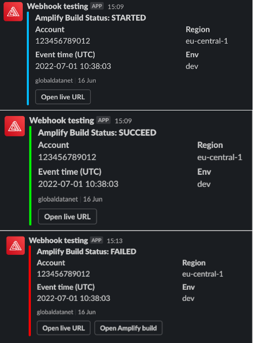
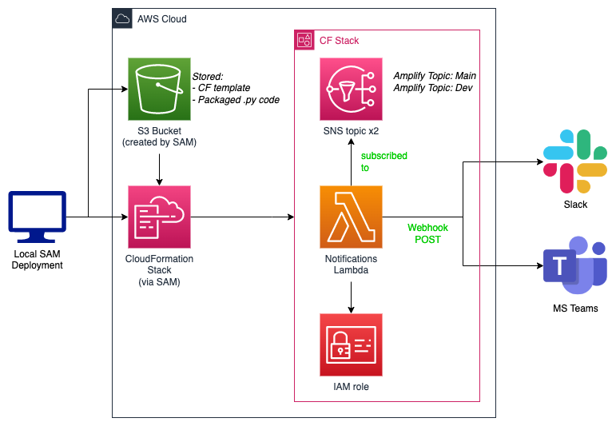

<!-- markdownlint-disable MD033 MD026 -->
<!-- MD033: No inline HTML | Reason: used for collapsable section(s) -->
<!-- MD026: No trailing punctuation | Reason: used for '# IMPORTANT' heading -->

# Amplify Slack Notifications

Ever wanted simple yet cool AWS Amplify build notifications in Slack?
Well here you go!



> ℹ MS Teams coming soon

## Table of contents

<details>
  <summary>Click to expand!</summary>

- [Amplify Slack Notifications](#amplify-slack-notifications)
  - [Table of contents](#table-of-contents)
  - [Architecture](#architecture)
  - [Resources](#resources)
  - [Installation](#installation)
    - [Slack](#slack)
    - [MS Teams (coming soon)](#ms-teams-coming-soon)
  - [Deployment](#deployment)
    - [Prerequisites](#prerequisites)
    - [Makefile](#makefile)
    - [Cleanup](#cleanup)

</details>

## Architecture



## Resources

- CloudFormation stacks
  - `aws-sam-cli-managed-default`
  - amplify-notifications
- S3 Buckets
  - `aws-sam-cli-managed-default`
- Lambda
  - Language: `python`
- IAM role
  - Lambda execution & logging

> ℹ Note: The `aws-sam-cli-managed-default` bucket & CF stack are created using `sam deploy --guided` and managed by AWS SAM. This is required in order to store the CF stack template + packaged / compiled Lambda code

## Installation

### Slack

In order to use notifications for Slack, follow these steps to create an **incoming webhook**:

[Incoming webhooks for Slack](https://slack.com/help/articles/115005265063-Incoming-webhooks-for-Slack)

1. [Create a new Slack app](https://api.slack.com/apps/new) in your workspace
2. From the Features page, toggle **Activate Incoming Webhooks** on
3. Click **Add New Webhook to Workspace**
4. Pick a channel that the app will post to, then click **Authorize**
5. Reference the Webhook URL in the `WebhookUrl` parameter when [deploying with AWS SAM](#deployment)

### MS Teams (coming soon)

Loading... ↺

## Deployment

Deployment is managed using AWS SAM

### Prerequisites

|                                                               Plugin                                                      |  Version  |
|---------------------------------------------------------------------------------------------------------------------------|-----------|
|  [AWS CLI](https://docs.aws.amazon.com/cli/latest/userguide/getting-started-install.html)                                 |>= v2.7    |
|  [SAM CLI](https://docs.aws.amazon.com/serverless-application-model/latest/developerguide/serverless-sam-cli-install.html)|>= v.1.55  |


### Makefile

In order to make deploying a little bit easier a Makefile is provided

Usage:

```bash
make help
```

### Cleanup

Done with playing around and the resources are not needed anymore?

1. Simply delete your created AWS CloudFormation stack via console or `SAM delete`
2. Don't forget to remove the `aws-sam-cli-managed-default` CF stack
